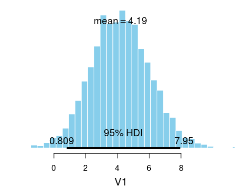
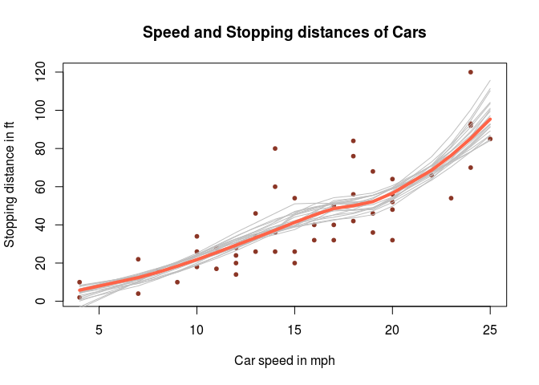

`bayesboot`: Easy Bayesian Bootstrap in R
=========================================

The `bayesboot` package implements a function `bayesboot` that performs the Bayesian bootstrap introduced by Rubin (1981). The implementation can both handle summary statistics that works on a weighted version of the data or that works on a resampled data set.

`bayesboot` is available on CRAN and can be installed in the usual way:

``` r
install.packages("bayesboot")
```

A simple example
----------------

Here is a Bayesian bootstrap analysis of the mean height of the last ten American presidents:

``` r
# Heights of the last ten American presidents in cm (Kennedy to Obama).
heights <- c(183, 192, 182, 183, 177, 185, 188, 188, 182, 185)

library(bayesboot)
b1 <- bayesboot(heights, mean)
```

The resulting posterior distribution in `b1` can now be `plot`ted and `summary`ized:

``` r
summary(b1)
## Bayesian bootstrap
## 
## Number of posterior draws: 4000 
## 
## Summary of the posterior (with 95% Highest Density Intervals):
##  statistic  mean    sd hdi.low hdi.high
##         V1 184.5 1.154   182.3    186.9
## 
## Quantiles:
##  statistic q2.5%  q25% median  q75% q97.5%
##         V1 182.3 183.7  184.5 185.2  186.9
## 
## Call:
##  bayesboot(data = heights, statistic = mean)
plot(b1)
```


While it is possible to use a summary statistic that works on a resample of the original data, it is more efficient if it's possible to use a summary statistic that works on a *reweighting* of the original dataset. Instead of using `mean` above it would be better to use `weighted.mean` like this:

``` r
b2 <- bayesboot(heights, weighted.mean, use.weights = TRUE)
```

The result of a call to `bayesboot` will always result in a `data.frame` with one column per dimension of the summary statistic. If the summary statistic does not return a named vector the columns will be called `V1`, `V2`, etc. The result of a `bayesboot` call can be further inspected and post processed. For example:

``` r
# Given the model and the data, this is the probability that the mean
# heights of American presidents is above the mean heights of
# American males as given by www.cdc.gov/nchs/data/series/sr_11/sr11_252.pdf
mean(c(b2[,1] > 175.9, TRUE, FALSE))
## [1] 0.9998
```

### Comparing two groups

If we want to compare the means of two groups, we will have to call `bayesboot` twice with each dataset and then use the resulting samples to calculate the posterior difference. For example, let's say we have the heights of the opponents that lost to the presidents in `height` the first time those presidents were elected. Now we are interested in comparing the mean height of American presidents with the mean height of presidential candidates that lost.

``` r
# The heights of oponents of American presidents (first time they were elected).
# From Richard Nixon to John McCain
heights_opponents <- c(182, 180, 180, 183, 177, 173, 188, 185, 175)

# Running the Bayesian bootstrap for both datasets
b_presidents <- bayesboot(heights, weighted.mean, use.weights = TRUE)
b_opponents  <- bayesboot(heights_opponents, weighted.mean, use.weights = TRUE)

# Calculating the posterior difference
# (here converting back to a bayesboot object for pretty plotting)
b_diff <- as.bayesboot(b_presidents - b_opponents)
plot(b_diff)
```



So there is some evidence that loosing opponents could be shorter. (Though, I must add that it is quite unclear what the purpose really is with analyzing the heights of presidents and opponents...)

A more advanced example
-----------------------

A slightly more complicated example, where we do Bayesian bootstrap analysis of LOESS regression applied to the `cars` dataset on the speed of cars and the resulting distance it takes to stop. The `loess` function returns, among other things, a vector of `fitted` *y* values, one value for each *x* value in the data. These *y* values define the smoothed LOESS line and is what you would usually plot after having fitted a LOESS. Now we want to use the Bayesian bootstrap to gauge the uncertainty in the LOESS line. As the `loess` function accepts weighted data, we'll simply create a function that takes the data with weights and returns the `fitted` *y* values. We'll then plug that function into `bayesboot`:

``` r
boot_fn <- function(cars, weights) {
  loess(dist ~ speed, cars, weights = weights)$fitted
}

bb_loess <- bayesboot(cars, boot_fn, use.weights = TRUE)
```

To plot this takes a couple of lines more:

``` r
# Plotting the data
plot(cars$speed, cars$dist, pch = 20, col = "tomato4", xlab = "Car speed in mph", 
     ylab = "Stopping distance in ft", main = "Speed and Stopping distances of Cars")

# Plotting a scatter of Bootstrapped LOESS lines to represent the uncertainty.
for(i in sample(nrow(bb_loess), 20)) {
  lines(cars$speed, bb_loess[i,], col = "gray")
}
# Finally plotting the posterior mean LOESS line
lines(cars$speed, colMeans(bb_loess, na.rm = TRUE), type ="l",
      col = "tomato", lwd = 4)
```



More information
----------------

For more information on the Bayesian bootstrap see [Rubin's (1981) original paper]((https://projecteuclid.org/euclid.aos/1176345338)) and my blog post [The Non-parametric Bootstrap as a Bayesian Model](http://sumsar.net/blog/2015/04/the-non-parametric-bootstrap-as-a-bayesian-model/). The implementation of `bayesboot` is similar to the function outlined in the blog post [Easy Bayesian Bootstrap in R](http://sumsar.net/blog/2015/07/easy-bayesian-bootstrap-in-r/), but the interface is slightly different.

References
----------

Rubin, D. B. (1981). The Bayesian bootstrap. *The annals of statistics*, 9(1), 130--134. [link to paper](https://projecteuclid.org/euclid.aos/1176345338)
